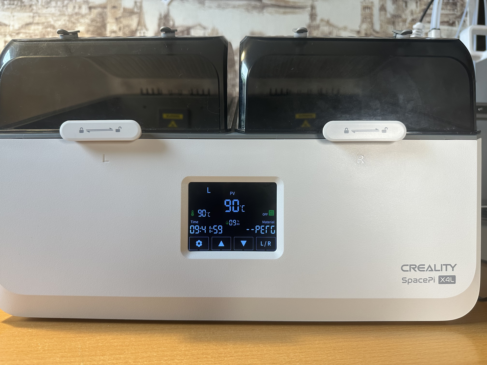
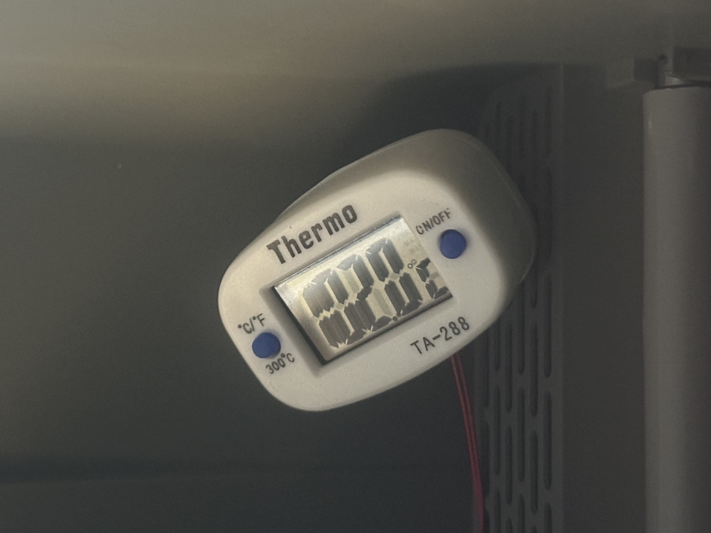
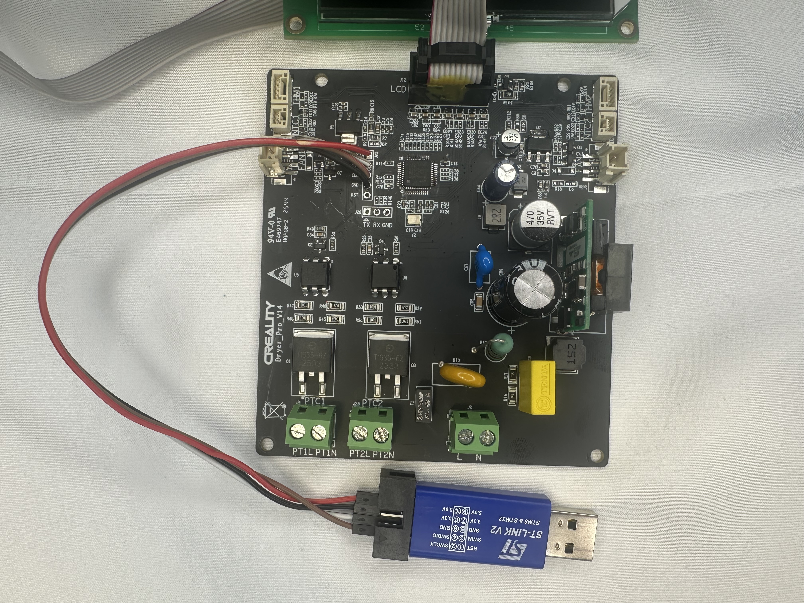
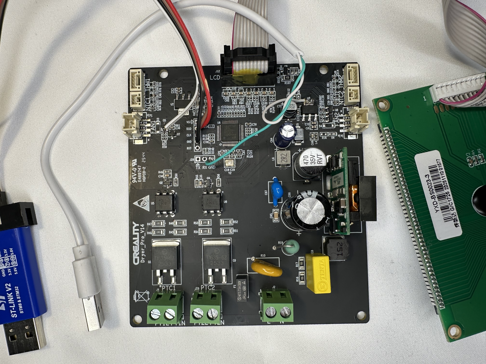

[Русский](README.md) · [English](README.en.md) · **Deutsch** · [Español](README.es.md) · [中文](README.zh.md)

# Creality Space Pi X4 Lite - Firmware-Flasher (90 °C Mod)

Plattformübergreifender (Windows / macOS / Linux) Flasher für den Filament-Trockner
**Creality Space Pi X4 Lite**. Er kann:

- die **Maximaltemperatur von 75 auf 90 °C anheben** (167 → 194 °F, Minimum sinkt auf 1 °C / 33.8 °F),
- die **Sensoranzeige** auf das eigene Gerät **kalibrieren**,
- jederzeit **auf die Werks-Firmware zurücksetzen**.

Es ist **eine einzige, eigenständige Datei `flash.py`** - alle Firmware-Images sind darin
eingebettet, nichts weiter herunterzuladen. Die Oberfläche gibt es in **5 Sprachen**
(RU / EN / DE / ES / 中文), gesteuert nur über Ziffern, nach dem Schreiben **liest der Flasher
die Firmware zurück und prüft sie Byte für Byte** und zeigt die ST-Link-Verdrahtung in der
Konsole. Geflasht wird über SWD via [pyOCD](https://pyocd.io/) (`pip install pyocd`, Standard)
oder [OpenOCD](https://openocd.org/). Der MCU ist **GD32F303CBT6** (Cortex-M4, softwarekompatibel
mit STM32F303).

<p align="center">
  
  <br>
  <em>Das Display zeigt die Arbeitstemperatur 90 °C (Kammervorderseite). Direkt am Heizungsauslass sind es 102 °C, die PTC-Heizungen liefern maximal etwa 120 °C (je nach Kalibrier-Offset) und beginnen dann abzuschalten (klicken).</em>
</p>

---

## ⚠️ SICHERHEIT - vor dem Anschließen lesen

> **Am einfachsten und sichersten ist es, die Platine über den 3.3-V-Pin des ST-Link zu
> versorgen - ohne 220 V und ohne separate 5-V-Quelle.** Dann gibt es gar kein Netz. Die
> aktuelle Platinen-Revision hat eine galvanische Trennung, daher kann der ST-Link auch bei anliegenden 220 V
> angeschlossen werden (siehe [„Flashen unter 220 V“](#flashen-unter-220-v-für-fortgeschrittene-auf-eigene-gefahr)),
> für gewöhnliches Flashen ist das aber nicht nötig.

**Öffnen und verdrahten (empfohlener Weg, ohne 220 V):**

1. Die selbstklebenden Füße an der Unterseite entfernen, um an die Gehäuseschrauben zu kommen. **Mit Föhn und Alkohol** den Kleber rückstandslos lösen und die Füße auf Klebeband legen, damit kein Staub darauf kommt.
2. Vier Leitungen ST-Link → Platine: **SWDIO, SWCLK, GND** und **3.3V → die 3.3-V-Schiene der Platine (MCU VDD)**.
3. **RST** wird nicht benötigt (sonst Dauer-Reboot) - Reset erfolgt per Software.
4. **Keine 220 V anlegen.** Mit nur 3.3 V bleibt das **Display dunkel - das ist normal**
   (seine Versorgung/Beleuchtung liegt nicht auf der 3.3-V-Schiene), zum SWD-Flashen wird es nicht gebraucht.

**Wichtig zu 3.3 V:**

- der Pin `3.3V` am ST-Link muss ein **Ausgang** sein - bei billigen Klonen ist das so, beim
  originalen ST-Link ist derselbe Pin `VTREF` (ein Mess-Eingang) und liefert keinen Strom,
- ausschließlich auf die **3.3-V-Schiene (MCU VDD)** geben - **5 V dort zerstören den Chip** (max. ~3.6 V),
- wird die Platine nicht erkannt oder bricht die Spannung ein, liefert der Klon zu wenig Strom,
  dann **5 V auf den 5-V-Eingang** der Platine geben (er speist den On-Board-3.3-V-Regler).

Der Mod hebt das werkseitige Temperaturlimit auf, Nutzung auf eigene Gefahr. **Die Hersteller-/
Händlergarantie erlischt dadurch eindeutig.** Das Kunststoffgehäuse des Trockners hält diese
Temperatur problemlos aus, es ist konstruktiv dafür ausgelegt. Den Trockner bei den ersten Läufen nicht unbeaufsichtigt lassen.

### Flashen unter 220 V (für Fortgeschrittene, auf eigene Gefahr)

Manchmal ist es praktisch, **ohne 220 V abzuschalten** zu flashen/debuggen (z. B. um die
Temperatur live beim Heizen zu lesen). Das ist nur sicher, **wenn die Digitalseite galvanisch
vom Netz getrennt ist**.

**Diese Platine hat eine galvanische Trennung:**

- die Versorgung kommt von einem **isolierten AC-DC-Modul mit Transformator** (35-V-Sekundärseite),
- die Heizungen werden über **Optokoppler** geschaltet (EL3063 → Triac) - ein Optokoppler existiert
  gerade dazu, die Verbindung „Netz ↔ MCU“ aufzutrennen,
- es gibt einen **Y-Kondensator** über die Trennbarriere nahe dem Modul.

Daher kann der ST-Link direkt unter 220 V angeschlossen werden. Bei einer anderen Revision
lässt sich die Trennung leicht mit dem Multimeter nachprüfen:

1. **Netz aus:** Durchgang zwischen **GND (am SWD)** und beiden Netz-Eingangspins (L und N) →
   sollte **offen / Megaohm** sein (kein niederohmiger Pfad = getrennt).
2. **(vorsichtig) Netz ein:** Wechselspannung zwischen Platinen-GND und Schutzleiter der Steckdose →
   eine getrennte Platine zeigt **~0 bis wenige Volt** (Y-Cap-Leckstrom), eine nicht getrennte zehn/hunderte Volt.

Live-Flashen unter 220 V ist möglich. Zusätzliche Sicherheit: ein **Laptop im Akkubetrieb**
(Ladegerät ausgesteckt). Sollte deine Revision doch keine Trennung haben, ist der Preis eines
Fehlers ein zerstörter Laptop/Platine oder ein Stromschlag, im Zweifel also mit **3.3 V vom
ST-Link** versorgen (oder 5 V auf den 5-V-Eingang zum Einschalten des Displays) **ohne 220 V** - wie am Anfang des
Sicherheitsabschnitts beschrieben.

---

## Was man braucht

- **SWD-Debugger:** ST-Link V2 (am billigsten und verbreitetsten), oder CMSIS-DAP, oder J-Link.
- **Leitungen** zu den SWD-Pads der Platine (Pad `J25`/SWD: SWDIO, SWCLK, GND).
- **Python 3.7+** und ein Flash-Werkzeug - **pyOCD** (empfohlen) oder OpenOCD.

### Flash-Werkzeug installieren

**Empfohlen - pyOCD** (ein Befehl, keine separate Binärdatei):

```bash
pip install pyocd
```

Das war's. Das CMSIS-Pack für den GD32F303 wird beim ersten Flashen **automatisch installiert**
(einmal Internet nötig). Nichts weiter herunterladen oder in PATH eintragen.

**Alternative - OpenOCD** (falls bereits installiert): `--backend openocd` übergeben. Installation:
macOS `brew install open-ocd`, Linux `sudo apt install openocd`,
Windows - [xpack-openocd](https://github.com/xpack-dev-tools/openocd-xpack/releases) in PATH
(oder `--openocd C:\Pfad\openocd.exe`).

> **Windows + ST-Link:** sowohl pyOCD als auch OpenOCD sprechen über libusb mit dem ST-Link - ist
> der Probe nicht sichtbar, braucht er den WinUSB-Treiber (über [Zadig](https://zadig.akeo.ie/)).

Standardmäßig wählt der Flasher das Backend selbst: pyOCD wenn vorhanden, sonst OpenOCD. Wird
keines gefunden, **bietet der Flasher an, pyOCD zu installieren** (`pip install pyocd`) direkt aus dem Menü.

---

## Verdrahtung (Fotos)

Empfohlener Weg - die Platine über **3.3 V am ST-Link-Pin** versorgen (ohne 220 V). Vier Leitungen:
**SWDIO, SWCLK, GND** und **3.3V → die 3.3-V-Schiene der Platine (MCU VDD)**, RST nicht nötig.

<p align="center">
  <br>
  <em>ST-Link V2 → SWD (SWDIO / SWCLK / GND) und 3.3 V auf die 3.3-V-Schiene der Platine.</em>
</p>

**Externe 5 V USB sind zum Flashen NICHT nötig** - der Chip wird über die 3.3 V des ST-Link geflasht.
Das Display bleibt dabei dunkel, und das ist in Ordnung: zum Schreiben der Firmware über SWD wird es nicht gebraucht.

5 V braucht man **nur, wenn man die Firmware weiterentwickelt** und das **Display leuchten** sehen will
(die UI live). Dann zusätzlich 5 V anlegen, wie auf dem Foto:

<p align="center">
  <br>
  <em>Optional: externe 5 V USB - damit das Display erwacht (nur für die Firmware-Entwicklung nötig).</em>
</p>

---

## Verwendung

Die Firmware-Images sind **in `flash.py` eingebettet** - es ist eine einzige eigenständige Datei,
der Ordner `firmware/` ist zum Ausführen nicht nötig (er liegt im Repo nur zur Prüfung/Transparenz).

Einfacher Modus - starten und Ziffern drücken:

```bash
python3 flash.py        # oder ./flash.py (die Datei ist ausführbar)
```

Schritte (alles Ziffern):

```
1. Sprache:  1) Русский  2) English  3) Deutsch  4) Español  5) 中文

2. Was flashen?
     1) 90 °C / 194 °F (Maximum anheben)
     2) Zurück auf Werk (75 °C / 167 °F)
     0) Beenden

3. Kalibrierung (nur bei 90 °C gefragt, nicht beim Zurücksetzen):
     Offset, °C [Enter=+11 / 0 / z. B. 9.5]      (+11 °C ≈ +20 °F)

4. Sicherheit:  1=ja (flashen)  0=abbrechen
```

Folge `Enter, Enter, Enter, 1` (Sprache → 90 °C → Kalibrierung +11 → Bestätigen) - fertig.

Ohne Menü (CLI):

```bash
python3 flash.py --lang en                 # UI-Sprache (ru|en|de|es|zh)
python3 flash.py --firmware mod90c --calibrate 11   # 90 °C Mod
python3 flash.py --firmware stock          # zurück auf Werk 75 °C
python3 flash.py --firmware my_dump.bin    # beliebige Firmware per Pfad
```

Nützliche Optionen:

```bash
python3 flash.py --list                    # verfügbare Firmware zeigen
python3 flash.py --speed 300               # SWD-Geschwindigkeit bei Verbindungsfehlern senken
python3 flash.py --dump backup.bin         # ZUERST die aktuelle Firmware sichern!
python3 flash.py --build-only out.bin      # die .bin ohne Flashen bauen (Test ohne Platine)
python3 flash.py --backend openocd         # OpenOCD statt pyOCD verwenden
```

**Tipp:** Vor dem ersten Flashen lohnt sich ein Backup der Werks-Firmware der konkreten Platine:
`python3 flash.py --dump my_factory_backup.bin`. Revisionen unterscheiden sich - das eigene Backup
stellt immer alles wieder her.

### Den Flasher ohne Platine testen

Man kann ohne irgendetwas anzuschließen prüfen, dass alles funktioniert:

```bash
python3 flash.py --list                                  # sieht er die Firmware
python3 flash.py --help                                  # alle Optionen
# eine kalibrierte .bin bauen und prüfen, dass sich genau 1 Byte ändert:
python3 flash.py --firmware mod90c --calibrate 11 --build-only /tmp/t.bin
cmp -l firmware/mod_90c.bin /tmp/t.bin                   # sollte 1 Zeile sein (die C1-Adresse)
```

`--build-only` rührt die Platine nicht an. Echtes Flashen geht nur mit angeschlossenem Debugger
und **abgeschalteten 220 V** (siehe Sicherheitsabschnitt).

---

## Temperaturkalibrierung

Der Sensor ist **nicht-linear**: kalt zeigt er fast richtig, aber **beim Heizen zu niedrig** - je
heißer, desto stärker. Die Kalibrierung addiert einen konstanten Offset, der auf den
**Arbeitspunkt (~90 °C)** abgestimmt werden sollte.

**Empfohlener Offset `+11 °C` (≈ +20 °F)** - warum so:

| | ohne Kalibrierung | mit `+11 °C` |
|---|---|---|
| kalt (Raum ~23 °C) | Display ~23 °C (korrekt) | Display ~34 °C (zu hoch) |
| beim Heizen auf reale 90 °C | Display nur ~79 °C | Display ~90 °C (korrekt) |

Ohne Offset bleibt das Display bei ~79 °C hängen, der Regler meint „nicht durchgeheizt“ und treibt
die PTC-Heizungen weiter → die Thermosicherung löst aus, was **ständiges Klicken** und niedrige/falsche
Anzeigen verursacht. Mit `+11` werden reale 90 °C korrekt angezeigt und geregelt - `90 = 90` (auf
Kosten der Genauigkeit im kalten Zustand, was egal ist - getrocknet wird heiß).

Im interaktiven Menü einfach **Enter** drücken (wendet +11 an). Man kann eine eigene Zahl eingeben -
aber für 90 °C sind meist etwa **+11** nötig. Der Offset nimmt **Nachkommastellen** (z. B. `10.5` oder
`11.3`) und **negative** Werte an - falls das Display stattdessen zu hoch zeigt (z. B. `-3`, Grenze ±30 °C).

> Der Offset ist in **°C** (interne Einheit der Firmware). Für ein Thermometer in °F: die Differenz in
> °C umrechnen (durch 1.8 teilen). Z. B. Display 174 °F, Thermometer 194 °F → Differenz 20 °F →
> `20 / 1.8 ≈ 11` → Offset **11**.

**Wenn es um ~90 °C klickt** - den Offset um ein paar Grad erhöhen (z. B. auf `+12…+13`). Je höher der
Offset, desto früher trennt der Regler die Heizung, sodass der Heizungsauslass die realen ~120 °C nicht
erreicht und die Bimetallsicherung nicht mehr klickt. Der Preis: die reale Kammertemperatur liegt ein
paar Grad unter dem Sollwert (meist akzeptabel).

**Den Offset für das eigene Gerät messen:**

1. Ein Thermometer (Thermoelement) in die **vordere PTFE-Schlauchöffnung** stecken.
2. Die Kammer aufheizen und die Temperatur einpendeln lassen.
3. Vergleichen, was der **Trockner** und was das **Thermometer** zeigt.
4. Offset = `Thermometer − Display`. Beispiel: Display 79, Thermometer 90 → Offset **+11**.

**Anwenden:**

```bash
python3 flash.py --firmware mod90c --calibrate 11    # +11 °C (empfohlen)
python3 flash.py --firmware mod90c --calibrate 0     # ohne Kalibrierung (Werk)
```

oder einfach `python3 flash.py` - das interaktive Menü fragt den Offset separat
(Enter = empfohlene +11, `0` = ohne Kalibrierung, oder eine eigene Zahl).

Der Offset gilt für **beide Kammern** (eine gemeinsame Sensorkonstante). Nach dem Flashen lohnt sich
eine erneute Kontrolle mit dem Thermometer und ggf. ein erneutes Flashen mit präziserem Wert.

> Technisch ändert die Kalibrierung eine Float-Konstante `C1` (`T = ADC·K − C1`, Werk `C1 = 50.0`) auf
> `50.0 − Offset`. Details - in [`docs/PATCHES.md`](docs/PATCHES.md) (Russisch).

---

## Klicken und der Temperaturgradient - das ist normal

Beim Trocknen hört man **Klicken** nahe der Heizung, und die Temperatur an der Rückwand und vorne
unterscheidet sich deutlich. Das ist **normales Verhalten**, kein Defekt:

- **Rückwand (Heißluftauslass):** ~**120 °C / 248 °F**. Das ist die eigene thermische Grenze der
  Heizung - bei ~120 °C (248 °F) schaltet sie ab, kühlt auf ~115 °C (239 °F) und schaltet wieder ein.
  Daher das Klicken (ein Zyklus 120 ↔ 115) - die Thermosicherung der Heizung, kein Firmware-Fehler.
- **Kammervorderseite (wo Thermometer / Filament ist):** ~**90 °C / 194 °F**. Das ist die
  Arbeitstemperatur, danach regelt das Gerät - und das zeigt das Display (nach Kalibrierung korrekt).
- **Differenz vorne/hinten:** etwa **30 °C (54 °F)**, d. h. die Luft an der Rückwand ist rund **~33 %
  heißer** als vorne (entsprechend: vorne ~25 % kühler als der Auslass). Ein normaler Temperaturgradient
  einer Durchströmungskammer.

Mit anderen Worten: es klickt kein „Firmware-Bug“, sondern die Heizung an ihrer Grenze am Auslass,
während vorne die eingestellten 90 °C (194 °F) gehalten werden.

**Wenn das Klicken stört** - es lässt sich durch **Erhöhen des Kalibrier-Offsets** beseitigen (z. B.
`+12…+13` statt `+11`): der Regler trennt die Heizung etwas früher, der Auslass erreicht ~120 °C nicht
und die Bimetallsicherung löst nicht aus. Die reale Temperatur liegt dann ein paar Grad unter dem
Sollwert. Siehe [„Temperaturkalibrierung“](#temperaturkalibrierung).

---

## Zwei Firmware-Images - der Unterschied

| Datei | Max. t | Für wen |
|------|:------:|------|
| `firmware/mod_90c.bin` | 90 °C / 194 °F | das Limit auf 90 °C anheben |
| `firmware/stock_factory_75c.bin` | 75 °C / 167 °F | zurück auf Werk |

### Zu E4 und Sicherheit

**E4** ist ein Sensor-/Heizungsfehlercode. Der Mod **entfernt den E4-Schutz nicht komplett**: wird der
Temperatursensor tatsächlich getrennt/kurzgeschlossen - **löst E4 weiterhin aus** und die Heizung wird
abgeschaltet (geprüft: Sensor trennen → Fehler erscheint).

Was der Mod tatsächlich lockert, ist der **Unterheiz-Watchdog**: die Werks-Firmware meldete E4, wenn
die Temperatur **85 % des Sollwerts** nicht erreichte (`0.85 × 90 = 76.5 °C`), und die auf 75 °C
begrenzte Heizung erreichte diese Schwelle nie → **dauerhaftes E4**. Der Mod entfernt genau diesen
Fehlauslöser, damit 90 °C erreichbar sind. Der Hardware-Schutz bleibt ebenfalls - die PTC-Heizungen
begrenzen sich konstruktiv selbst.

---

## Was der Mod genau ändert (für Neugierige)

Der Mod besteht aus Byte-Patches der Werks-Firmware (128 KB, geladen ab `0x08000000`). Die vollständige
Karte ist in [`docs/PATCHES.md`](docs/PATCHES.md) (Russisch). Kurz:

- Sollwert-Klemmungen `75 → 90 °C` und `45 → 1 °C` (Zonen 1 und 2),
- Erweiterung des Sollwertbereichs im Menü auf 90,
- Entfernen der Klemmung der angezeigten/geregelten Temperatur bei 80.0 °C,
- Umleiten des Unterheiz-Watchdogs am E4-Handler vorbei (der Sensorfehler-E4 bleibt erhalten).

Die Sensorfunktion und die Sollwertregelung sind **unangetastet** - die Heizung schaltet beim Erreichen
des Ziels wie gewohnt ab.

> Tiefer graben / die Firmware weiterentwickeln (eigene Kalibrierung, Lüfterdrehzahl, UI)? Notizen zur
> Platine und zum Reverse Engineering sind in [`docs/REVERSE.md`](docs/REVERSE.md) (Russisch).

---

## Wenn etwas schiefgeht

- **Probe nicht sichtbar / `No available debug probes`** → Kabel und Treiber prüfen
  (Windows: WinUSB via [Zadig](https://zadig.akeo.ie/)), `--speed` auf `300` oder `200` senken.
- **`unable to connect` / `init mode failed`** → die Platine wird nicht mit 5 V/3.3 V versorgt,
  schlechter SWDIO/SWCLK/GND-Kontakt, oder die Geschwindigkeit ist zu hoch.
- **pyOCD: `Target type ... not found`** → das Pack wurde nicht rechtzeitig installiert, manuell
  `pyocd pack install gd32f303cb` (Internet nötig), dann erneut versuchen.
- **pyOCD zickt bei einer bestimmten Platine** → auf OpenOCD wechseln: `--backend openocd`.
- **Falsche Firmware geflasht / Platine verhält sich seltsam** → `stock` (oder dein Backup) flashen.
  Durch Flashen wird die Platine nicht zum Ziegel - SWD ist immer verfügbar.

---

## Haftungsausschluss

Ein Hobbyprojekt, nicht mit Creality verbunden. Das Aufheben des Temperaturlimits und jegliche
Modifikationen erfolgen **auf eigene Gefahr**. Die Autoren haften nicht für Schäden an Geräten,
Eigentum oder für Verletzungen. Die Regeln zur Elektrosicherheit aus dem obigen Abschnitt beachten.

---

## Lizenz

Der Flasher wird unter der **[GNU GPL v3](LICENSE)** © 2026 Alexey Verhogladov vertrieben.
Die Firmware-Images sind Byte-Modifikationen des Werks-Images von Creality, bereitgestellt „wie besehen“
für Reparatur/Forschung, die Verantwortung für die Nutzung liegt beim Anwender.

---

## 💚 Unterstützen

Das Projekt ist kostenlos und aus Enthusiasmus entstanden. Wenn es geholfen hat - danke für die Unterstützung (USDT):

| Netzwerk | Adresse |
|------|-------|
| USDT · **TRC20** | `TYLmBvdxL8t9ziyZiFp3jcHwQbAsZR5haZ` |
| USDT · **TON** | `UQCnVND-uBgkWIAD1UP14tsN8239KE5BTOfKSJmg-0XqrN-k` |
| USDT · **ERC20** | `0xa61dcA98A86D84883Ddb3d62aA7F008f157c8eFF` |
